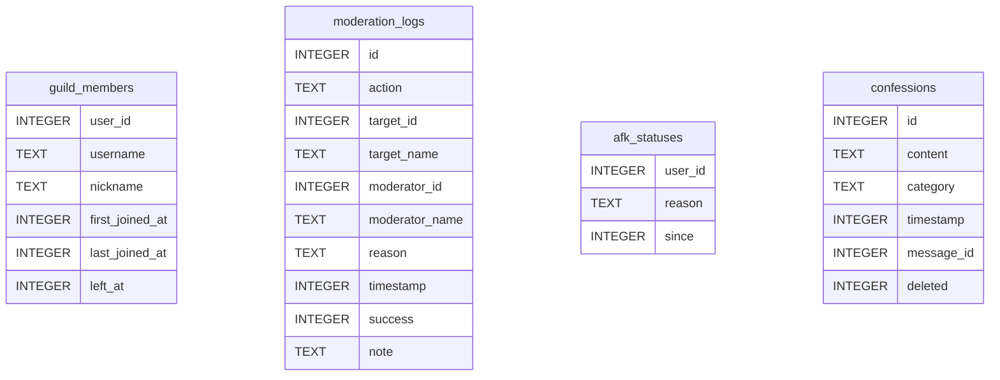

```mermaid
erDiagram
    guild_members {
        INTEGER user_id
        TEXT username
        TEXT nickname
        INTEGER first_joined_at
        INTEGER last_joined_at
        INTEGER left_at
    }

    moderation_logs {
        INTEGER id
        TEXT action
        INTEGER target_id
        TEXT target_name
        INTEGER moderator_id
        TEXT moderator_name
        TEXT reason
        INTEGER timestamp
        INTEGER success
        TEXT note
    }

    afk_statuses {
        INTEGER user_id
        TEXT reason
        INTEGER since
    }

    confessions {
        INTEGER id
        TEXT content
        TEXT category
        INTEGER timestamp
        INTEGER message_id
        INTEGER deleted
    }

```
