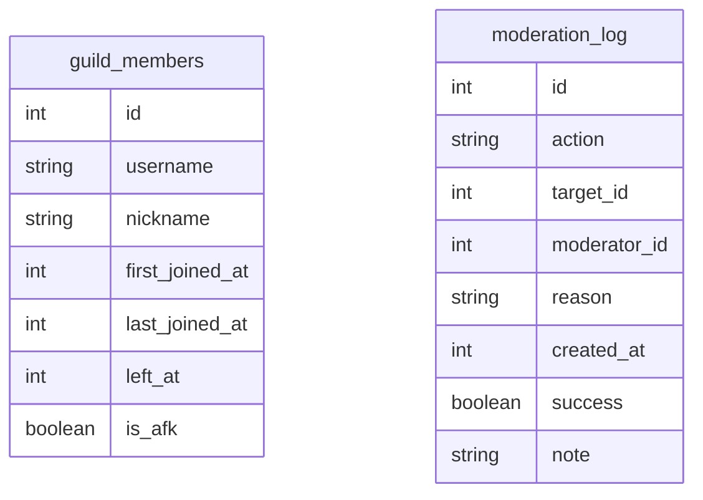

```mermaid
erDiagram
    guild_members {
        int id
        string username
        string nickname
        int first_joined_at
        int last_joined_at
        int left_at
        boolean is_afk
    }

    moderation_log {
        int id
        string action
        int target_id
        int moderator_id
        string reason
        int created_at
        boolean success
        string note
    }
```
